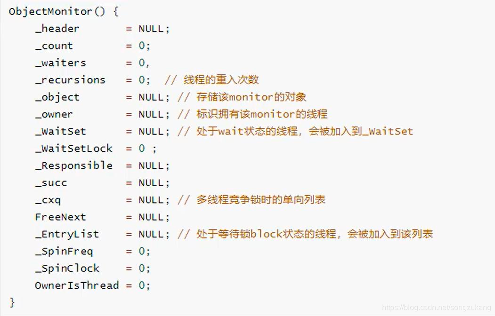
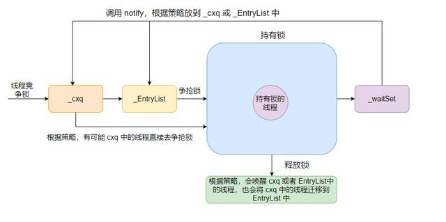

# volatile: 
修饰变量
实现原理： 修改该变量后必须写回主存，并且其他线程会失效自己的缓存数据
应用场景：标志位，或者一次写入或读取

# synchronized
https://blog.csdn.net/liujiqing123/article/details/120713022
互斥同步锁，保证最高级的并发,是非公平锁

## Monitor
https://baijiahao.baidu.com/s?id=1722037679060637190&wfr=spider&for=pc
每个对象都有一个锁头，使用synchronized(obj)时就会利用这个对象 

需要在同步块内调用
wait([long time]) 让出线程控制权，等待唤醒
notify() 随机唤醒一个在该锁对象上wait的线程，让其得到锁
notifyAll() 唤醒所有～

线程进入cxq中，当owner为空时，线程按照顺序进入entryList，最后一个线程得到锁，第一把锁释放后，随机唤醒entryList中的一个线程

## 锁优化
https://www.cnblogs.com/yescode/p/14474104.html

### 轻量级锁
修改monitor 记录，如果替换成功，则获取锁，否则膨胀为重量级锁

### 重量级锁
会经过内核态与用户态转换

# Thread 线程
## 实现方式
Thread 继承
Runnable 实现
Callable 可以有返回值，但是需要配合线程池或者FutureTask 来进行调用

## 线程状态
创建、就绪、运行、阻塞、死亡

## 线程中断
线程中断不代表线程结束，而是一个标志状态位，在一些方法中（wait,join）弹出interruptException可以到达唤醒线程的效果